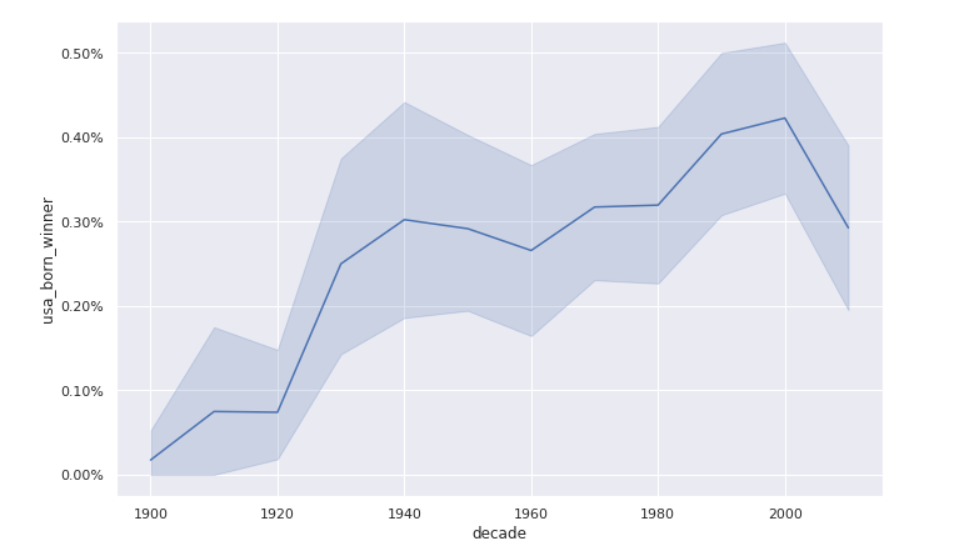

# Nobel_Prize_Analysis
1. [Description](#description)
2. [Requirements](#requirements)
3. [Library](#library)
4. [Output](#output)
5. [Conclusion](#conclusion)
6. [Acknowledgement](#acknowledgement)

## Description
Dog breed classifer is Udacity Data Science Nanodegree Project which invloves Opencv,tensorflow. Which bases on Convolutional Neural Networks.It's Great learning experience with Udacity.This app identify dog breed of input images and if input is human face model suggest dog breed.
Kindly refer my python notebook for all the steps of This project

## Requirements
* Python 3.6
* Libraries : Pandas,OpenCV,Numpy

## Output
Let's See some output 

some interesting output

